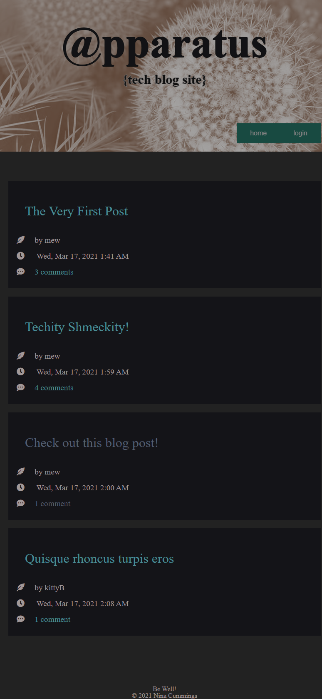
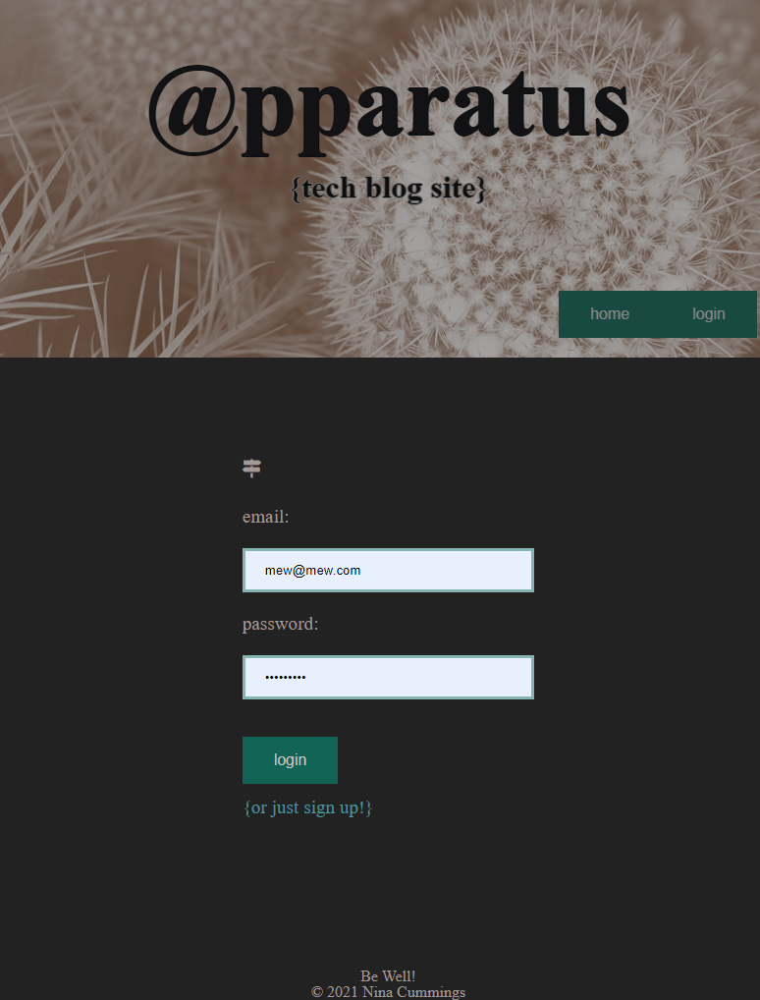
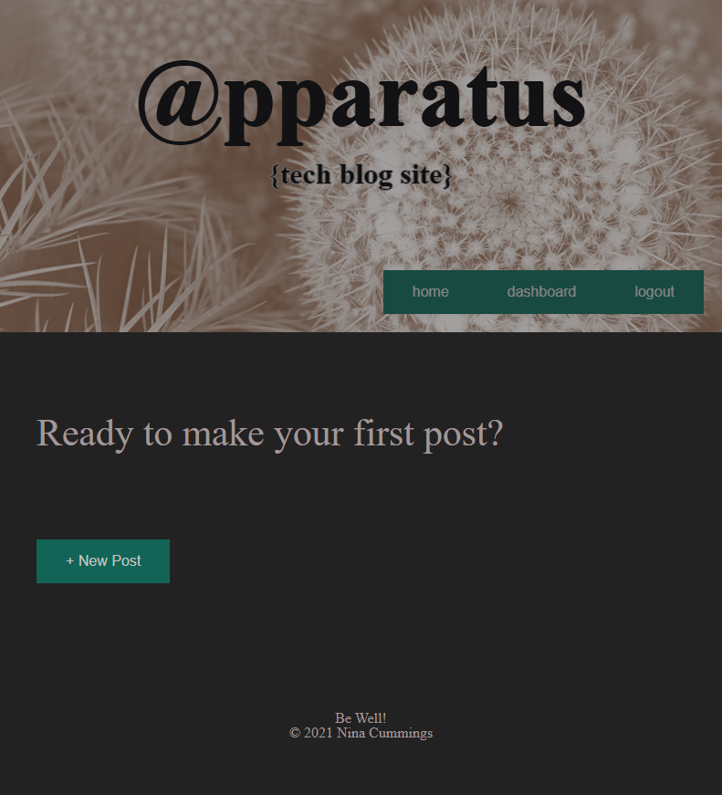
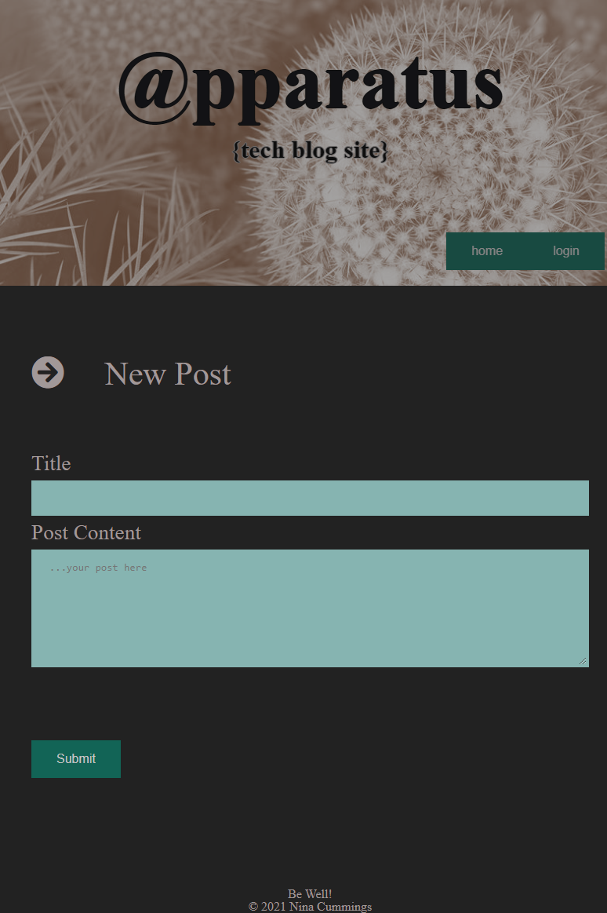
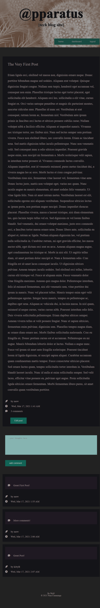

# Apparatus

---------------------------------------

## Description

This is a Tech Blog App that allows users to signup for login credentials, read, write, edit and delete blog posts in a forum

---------------------------------------

## Project Link

[Apparatus](https://quiet-ocean-12254.herokuapp.com/)

---------------------------------------

## Screenshots

---------------------------------------

## Testing

Provided within this repository are several tests (_tests_) in Jest for the helpers, to use them simply run npm install in the folder, then npm test.

---------------------------------------

## Languages

                    
* JavaScript
   
* HTML
   
* CSS
   
* ES6
   
* Node
   

---------------------------------------

## Questions

For any input, concerns, bugs or questions please get in touch!  Simply reach out to [Nina Cummings](https://github.com/jaderiver62/apparatus) via GitHub or via e-mail: jaderiver64@gmail.com.

---------------------------------------

## Licence

#### This project is licensed under the [MIT License](https://opensource.org/licenses/MIT).
#### &copy; 2021 Nina Cummings

---------------------------------------
    